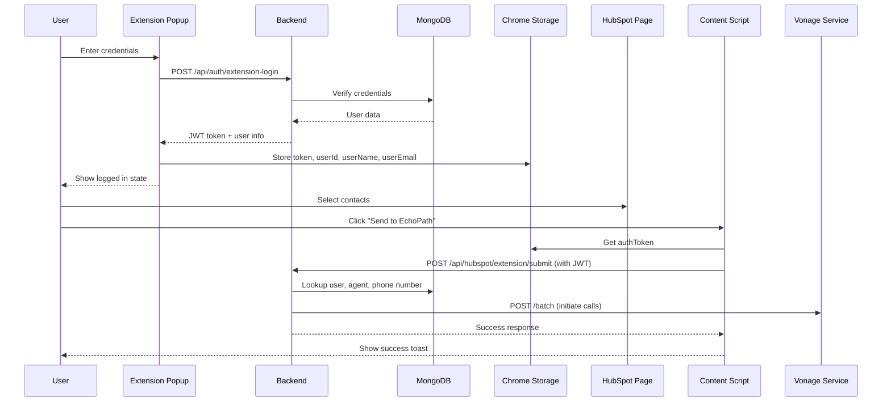

# 📞 EchoPath HubSpot Chrome Extension

A Chrome extension that seamlessly integrates HubSpot CRM with EchoPath's AI-powered batch calling system. Select contacts directly from your HubSpot contacts page and initiate automated calls with AI agents powered by ElevenLabs and Vonage.


---

## ✨ Features

- 🎯 **One-Click Contact Selection** - Select multiple contacts directly from HubSpot
- 📞 **Batch Call Initiation** - Send selected contacts to EchoPath for automated calling
- 🔐 **Secure Authentication** - JWT-based authentication with extension credentials
- 🎨 **Seamless Integration** - Floating button that integrates naturally with HubSpot UI
- ✅ **Real-time Validation** - Only contacts with phone numbers can be selected
- 📊 **Live Counter** - Shows how many contacts are currently selected
- 🎨 **Beautiful Toast Notifications** - User-friendly success/error messages

---

## 📋 Prerequisites

Before installing the extension, ensure you have:

1. **Google Chrome Browser** (version 88 or higher)
2. **HubSpot CRM Account** with access to contacts
3. **EchoPath Account** with:
   - Valid `extension_id` and `extension_pass` credentials
   - At least one outbound AI agent configured
   - A Vonage phone number assigned to your agent

---

## 🚀 Installation (Development Mode)

### Step 1: Clone or Download the Extension

```bash
# Navigate to the extension directory
cd hubspot-chrome-extension
```

### Step 2: Configure the Backend URL

Open `content.js` and update the API endpoint if needed:

```javascript
// For local development
const API_BASE = 'http://localhost:5000';

// For production
const API_BASE = 'https://your-backend-domain.com';
```

Also update `popup/popup.js`:

```javascript
const API_BASE = 'http://localhost:5000';  // Change as needed
```

### Step 3: Load the Extension in Chrome

1. Open Chrome and navigate to `chrome://extensions/`
2. Enable **Developer mode** (toggle in top-right corner)
3. Click **"Load unpacked"**
4. Select the `hubspot-chrome-extension` folder
5. The extension should now appear in your extensions list

### Step 4: Pin the Extension (Optional)

1. Click the **Extensions icon** (puzzle piece) in Chrome toolbar
2. Find "EchoPath HubSpot Extension"
3. Click the **pin icon** to keep it visible

---

## 🔧 Configuration

### Backend Setup

Ensure the EchoPath backend is running and properly configured:

#### 1. Environment Variables

**File**: `echoPathAI/backend/.env`

```bash
# Node.js Backend Port
PORT=5000

# MongoDB Connection
MONGO_URI=mongodb+srv://your_credentials

# Voice-to-AI-Engines (Vonage Service)
VOICE_TO_AI_ENGINES_URL=https://vonage.tensorark.com

# JWT Secret for Authentication
JWT_SECRET=your_secret_key
```

#### 2. Start the Backend

```bash
cd echoPathAI/backend
npm install
npm start
# Should see: Server is running on port 5000
```

---

## 📖 How to Use

### First-Time Setup

1. **Click the extension icon** in your Chrome toolbar
2. **Enter your credentials**:
   - Extension ID (provided by EchoPath admin)
   - Extension Password
3. **Click "Login"**
4. You should see a success message and your user information

### Making Batch Calls

1. **Navigate to HubSpot Contacts**:
   - Go to `https://app.hubspot.com/contacts/[your-portal-id]/objects/0-1/views/all/list`

2. **Wait for Extension to Load**:
   - The "📞 Send to EchoPath" button will appear in the bottom-right corner

3. **Select Contacts**:
   - Check the boxes next to contacts you want to call
   - The button counter updates automatically
   - Only contacts with phone numbers can be selected

4. **Initiate Calls**:
   - Click the **"📞 Send to EchoPath (X)"** button
   - Confirm selection
   - Toast notification will show success or error

5. **Monitor Progress**:
   - Calls are initiated automatically
   - Check the EchoPath dashboard for batch status
   - View call analytics and outcomes

---

## 📦 Building for Production

### Step 1: Update Configuration

1. **Update API endpoints** to production URLs:

   ```javascript
   // content.js
   const API_BASE = 'https://api.echopath.com';
   
   // popup/popup.js  
   const API_BASE = 'https://api.echopath.com';
   ```

2. **Update manifest version** (if needed):

   ```json
   {
     "version": "1.0.0",
     "version_name": "1.0.0"
   }
   ```

### Step 2: Package the Extension

1. **Create a production folder**:
   ```bash
   mkdir hubspot-extension-production
   cp -r hubspot-chrome-extension/* hubspot-extension-production/
   ```

2. **Remove development files**:
   ```bash
   cd hubspot-extension-production
   rm -rf .git
   rm -rf node_modules
   rm README.md
   ```

3. **Create a ZIP file**:
   ```bash
   # On Windows (PowerShell)
   Compress-Archive -Path * -DestinationPath ../hubspot-extension-v1.0.0.zip
   
   # On Mac/Linux
   zip -r ../hubspot-extension-v1.0.0.zip .
   ```

### Step 3: Publish to Chrome Web Store (Optional)

1. **Create a Chrome Developer Account**:
   - Go to [Chrome Web Store Developer Dashboard](https://chrome.google.com/webstore/devconsole)
   - Pay one-time $5 registration fee

2. **Upload the Extension**:
   - Click "New Item"
   - Upload the ZIP file
   - Fill in extension details:
     - Name: "EchoPath - AI Batch Calling for HubSpot"
     - Description: [See below]
     - Category: Productivity
     - Language: English

3. **Add Screenshots**:
   - Capture screenshots of the extension in action
   - Include: Login screen, contact selection, and success notifications

4. **Submit for Review**:
   - Review can take 1-7 days
   - Address any feedback from Google

---

## 📝 Extension Description (For Chrome Web Store)

```
EchoPath HubSpot Integration - Supercharge Your Sales Outreach

Instantly convert your HubSpot contacts into automated AI-powered phone calls. Select contacts directly from your HubSpot CRM and let EchoPath's intelligent AI agents make the calls for you.

✨ Key Features:
• Select multiple contacts with one click
• Automated batch calling with AI agents
• Real-time contact validation
• Seamless HubSpot integration
• Secure JWT authentication
• Beautiful, intuitive interface

🔧 How It Works:
1. Install the extension
2. Login with your EchoPath credentials
3. Select contacts in HubSpot
4. Click "Send to EchoPath"
5. Let AI agents handle the calls!

📊 Perfect For:
• Sales teams doing outbound calling
• Lead nurturing campaigns
• Customer re-engagement
• Appointment setting
• Market research calls

🔒 Security:
• Bank-level encryption
• JWT token authentication
• Secure API communication
• No data stored locally

Requires an active EchoPath account. Visit echopath.com to sign up.
```

---

## 🗂️ File Structure

```
hubspot-chrome-extension/
├── manifest.json           # Extension configuration
├── content.js             # Main extension logic (runs on HubSpot pages)
├── background.js          # Background service worker
├── popup/
│   ├── popup.html         # Login popup interface
│   ├── popup.js           # Popup authentication logic
│   └── popup.css          # Popup styling
├── icons/
│   ├── icon16.png         # 16x16 icon
│   ├── icon48.png         # 48x48 icon
│   └── icon128.png        # 128x128 icon
└── README.md              # This file
```

---

## 🔑 Authentication Flow



---

## 🌐 API Endpoints Used

### 1. **Login**
```
POST /api/auth/extension-login
Body: { extension_id, extension_pass }
Response: { success, token, userId, userName, userEmail }
```

### 2. **Submit Contacts for Batch Calling**
```
POST /api/hubspot/extension/submit
Headers: { Authorization: Bearer <token> }
Body: { contacts: [{ name, phone, email, ... }] }
Response: { success, batchId, validContacts, message }
```

---

## 🐛 Troubleshooting

### Extension Not Loading

**Issue**: Extension icon doesn't appear or button doesn't show on HubSpot

**Solutions**:
1. Check that you're on a HubSpot contacts page URL
2. Refresh the page (Ctrl+R or Cmd+R)
3. Check browser console for errors (F12)
4. Ensure extension is enabled in `chrome://extensions/`

---

### "Extension Context Invalidated" Error

**Issue**: Error message after extension update

**Solutions**:
1. **Refresh the HubSpot page** (Ctrl+R)
2. Close and reopen the HubSpot tab
3. The extension tells you to refresh - just do it!

---

### Login Fails

**Issue**: Can't login with extension credentials

**Solutions**:
1. **Check backend is running**:
   ```bash
   # Should respond
   curl http://localhost:5000/api/auth/extension-login
   ```

2. **Verify credentials**:
   - Contact EchoPath admin for correct credentials
   - Ensure no extra spaces in extension ID or password

3. **Check browser console**:
   - Open DevTools (F12)
   - Look for network errors or CORS issues

4. **Verify MongoDB connection**:
   - Backend needs MongoDB to verify credentials
   - Check backend terminal for connection errors

---

### "No Agent Assigned" Error

**Issue**: Error saying no AI agent is configured

**Solutions**:
1. **Check database** - User document needs `assistants` array:
   ```javascript
   {
     email: "user@example.com",
     assistants: [{
       id: "agent_xxx",
       name: "AI Agent Name"
     }]
   }
   ```

2. **Verify agent exists** in Agent collection with matching `agent_id`

3. **Assign agent** through EchoPath dashboard or admin panel

---

### "No Phone Number Assigned" Error

**Issue**: Error saying no phone number is assigned to agent

**Solutions**:
1. **Check Agent document** has `vonage_phone_number` field:
   ```javascript
   {
     agent_id: "agent_xxx",
     vonage_phone_number: {
       phone_number: "+1234567890",
       lvn: "1234567890",
       country: "US"
     }
   }
   ```

2. **Assign phone number** through Phone Number Management UI

3. **Verify phone number status** is "assigned" (not "unassigned")

---

### Calls Not Initiating

**Issue**: Success message shown but no calls are made

**Solutions**:
1. **Check Vonage service** is running:
   ```bash
   curl https://vonage.tensorark.com/batch
   ```

2. **Verify VOICE_TO_AI_ENGINES_URL** in backend `.env`:
   ```bash
   VOICE_TO_AI_ENGINES_URL=https://vonage.tensorark.com
   ```

3. **Check backend logs** for forwarding errors

4. **Verify batch record created** in MongoDB `batchprocessings` collection

---

### Selected Contacts Not Sent

**Issue**: Some contacts are skipped

**Reason**: Contacts without phone numbers are automatically filtered out

**Solutions**:
1. **Add phone numbers** to contacts in HubSpot
2. Check the response message - it shows `validContacts` vs `totalContacts`
3. Only contacts with valid phone numbers will be called

---

## 📊 Extension Permissions Explained

```json
{
  "permissions": [
    "storage"          // Store authentication token and user info
  ],
  "host_permissions": [
    "https://app.hubspot.com/*",    // Access HubSpot contacts page
    "http://localhost:5000/*",      // Dev backend (change for production)
    "https://your-api.com/*"        // Production backend
  ]
}
```

---

## 🔄 Version History

### v1.0.0 (Current)
- ✅ Initial release
- ✅ Contact selection from HubSpot
- ✅ JWT authentication
- ✅ Batch call initiation
- ✅ Toast notifications
- ✅ Extension context invalidation handling

---

## 🤝 Support

For issues or questions:
- **Email**: support@echopath.com
- **Dashboard**: https://echopath.com/dashboard
- **Documentation**: https://docs.echopath.com

---

## 📜 License

MIT License - Copyright (c) 2025 EchoPath AI

---

## 👨‍💻 Development

### Local Testing

1. **Start the backend**:
   ```bash
   cd echoPathAI/backend
   npm start
   ```

2. **Load extension** in Chrome (Developer mode)

3. **Open HubSpot** contacts page

4. **Check console** for logs:
   ```javascript
   // Extension loads
   🚀 [EchoPath] Content script loaded
   ✅ [EchoPath] Ready!
   
   // When sending
   📤 [EchoPath] Send button clicked
   📋 Sending 3 contacts to echoPathAI backend...
   ✅ Success: { batchId: "...", validContacts: 3 }
   ```

### Debugging

**Chrome DevTools**:
- Right-click extension popup → "Inspect"
- F12 on HubSpot page → Check Console tab
- Network tab → See API requests

**Backend Logs**:
```
📱 [HubSpot Extension] Received 3 contacts from user 123...
👤 User found: user@example.com
🤖 Agent ID: agent_xxx
📞 Agent phone number: 1234567890
✅ Validated 3 contacts
💾 Batch BATCH_xxx created
🚀 Forwarding to voice-to-ai-engines...
✅ Batch forwarded successfully
```

---

## 🚀 Deployment Checklist

- [ ] Update `API_BASE` to production URL in `content.js`
- [ ] Update `API_BASE` to production URL in `popup/popup.js`
- [ ] Update `version` in `manifest.json`
- [ ] Test login flow with production credentials
- [ ] Test contact selection and submission
- [ ] Verify calls are initiated successfully
- [ ] Take screenshots for Chrome Web Store
- [ ] Write/update extension description
- [ ] Create ZIP file
- [ ] Upload to Chrome Web Store (if publishing)
- [ ] Test installation from Web Store
- [ ] Monitor error logs after deployment

---

**Built with ❤️ by the EchoPath Team**
